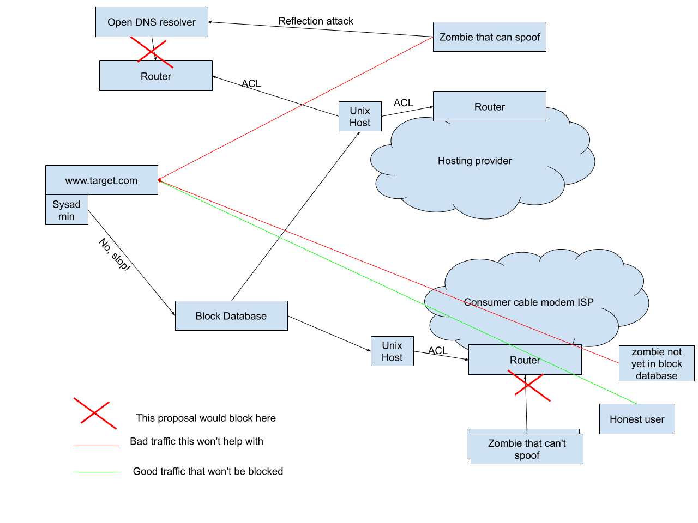

# Firewalls at the source for DDoS

## Summary

I propose a system where owner of a netblock can publish a list traffic patterns
that they perceive to be DoS attacks, and where service providers (of all types)
can use this list to filter DoS packets at the source. Importantly only
destinations that complain about an IP address would have those sources
blocked. This is not a list of "bad IPs", and any block should be
destination-specific. This would spare network resources across the Internet,
and especially spare the target and their ISP.

Like a [bandwidth enforcer][bwe] but for DDoS attacks on the public Internet.

## Attack types

### Application attacks -- Not stopped

TCP connection established, followed by some expensive query, or simply a
quantity of queries whose sum effect is expensive. Causing resource use on the
target side doesn't have to be through lots of queries. It can be a [Slowloris][slowloris]
sort of attack or [hash flooding attacks][hash-flooding].

This kind of attack can just as well be filtered at the target side, since we'll
assume a TCP connection can't be spoofed. (this is true enough)

This attack doesn't have collateral damage in the form of network breakdown.

### Direct spoofed packet attacks -- Not stopped

This design does not protect against this attack. There are strictly fewer
sources that are capable of spoofing on the Internet than there are ones that
cannot spoof.

### Reflected spoofed packet attacks -- Should help here

Open DNS or NTP servers that respond to spoofed packets can overload pps or bps
of the target. These can largely be protected against, since a target can say "I
don't want packets from 8.8.8.8 to my webserver, because they are reflection
attacks". (I hope 8.8.8.8 being run by Google hopefully would detect this and
stop reflecting, but for the general case this would be useful)

### Unspoofed packet attacks -- Should help here

This proposal should be very effective against these. Linearly so, meaning when
you block half the zombies you'll reduce the attack by half.

## For targets

A "target" is the victim of a DDoS attack, who wants to protect themselves and
Internet infrastructure in general.

Using a public key stored in whois or reverse DNS (with DNSSEC) a website owner
would push a list of IP prefixes and/or other traffic patterns they do not want
traffic from. They would hopefully be able to identify attackers, and if they do
it wrong they'll only blackhole themselves.

Targets would also love to be able to block a wide net. Say a Swedish local
store is being DDoSed. It'd be nice if they could "block all non-EU
prefixes". Doesn't matter as much if they get them all by that rule as "how much
did they get".

Another rule would be "block all from comcast to 1.2.3.4/24", and comcast pushes
out that ACL on their end.

## For ISPs

ISP would pull down filters, and push them out as ACLs to the first hop closest
to the source. Depending on access technology the number of devices behind one
first hop router could vary greatly, and this may or may not be feasible.

For mobile deployments this could greatly help the ISP since it could reduce the
use of radio network resources.

If an ISP doesn't want mom&pop targets to be able to push ACLs, then they could
choose to subscribe to only when they see their customers are DDoSing big
customers like github.

ISPs could also just use this to collect statistics, to see which customers are
naughty. For example if 1000 organizations try to block Bob, then Bob is
probably running an infected machine or open reflector. Maybe the ISP can then
route all of Bob's traffic through their DPI/shaper.

## Effectiveness

Every source (ISP) that implements this should be a win. Yes, a large botnet of
machines that can't spoof can still cycle through the entire botnet and assuming
there are no patterns for the target they will be successful. But I claim
(without data to back it up) that it's a good thing to at least force botnet
owners to expose a larger portion of their botnet to do this. That or expose
what is presumably the higher valued part of their botnet, the part that can
spoof.

Let's say Comcast implements this. Then 30 million subscribers can be owned and
still have firewalling available at the source.

The big question is really: How much ACL space can we take from first-hop access
routers (or peering routers for that matter)? Prioritizing and aggregation can
be done either by the ISP-owned deployer or by central database, or both.

## Cloud aspects

Receiving data into AWS and GCP is free, so this proposal would have no benefit
for cloud customers over simply firewalling either in the Cloud API, or using
classic iptables rules. The former is probably preferable since while iptables
is fast, not having to process the packets at all is faster.

But cloud outgoing traffic is expensive, so a cloud customer would have good
reason to want to stop any traffic where the recipient (target) is saying "uh,
please don't". If the target doesn't want the traffic, then presumably it would
be dropped eventually anyway, so nothing is lost, and money is saved.

## Potential for abuse

### Firewall "because I can"

Preemptively pushing out firewall rules, pretending to be under attack from lots
of places because maybe some day you will be. This would take up ACL space
needlessly.

TODO: How to solve this, without false positives/negatives?

### PII

Additionally, the data collected and provided for the purposes of firewalling
can be used to expose user behaviors. This data is considered PII / CPNI in
some jurisdictions and may be unavailable for use (for protection or as a source
of the data) in those locations.

To reduce the possibility of being publicly blamed, the central service could
choose to only send the filters to network A where the filter has "block from A
to B". Thus only A knows that a subset of its users should be blocked from B.

## How it relates to other solutions

### [Pushback][pushback]

TODO

### [DOTS][dots]

DOTS assumes source address in packets can never be trusted (only true for
spoofed packet attacks), and requires manual setup for every hop in the
link. BGP is hard enough politically and origin-authenticatingly, and this seems
like just asking for the same problem again.

Though it does address the direct spoofed traffic, which is nice and complementary.

### BGP communities for DoS

This proposal is similar in high level design to BGP communities, except:
* it'd be available to everyone with a whois entry
* would be able to do better than just blackhole the target. The point was to
  get the site *up*, right?
* works multi-hop, in fact bypasses the need for intermediary ISPs to even opt
  in or configure anything.

[bwe]: https://static.googleusercontent.com/media/research.google.com/en//pubs/archive/43838.pdf
[pushback]: https://www.cs.columbia.edu/~smb/papers/pushback-impl.pdf
[dots]: https://datatracker.ietf.org/wg/dots/charter/
[slowloris]: https://en.wikipedia.org/wiki/Slowloris_(software)
[hash-flooding]: https://131002.net/siphash/siphashdos_appsec12_slides.pdf
